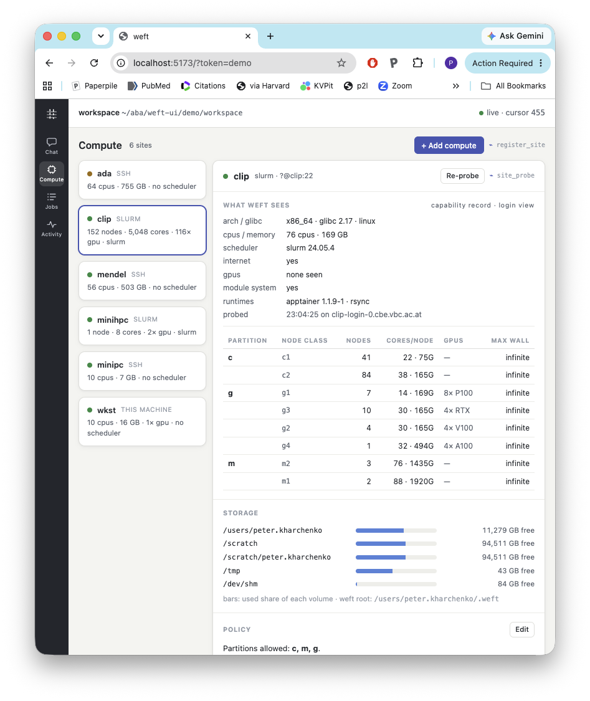
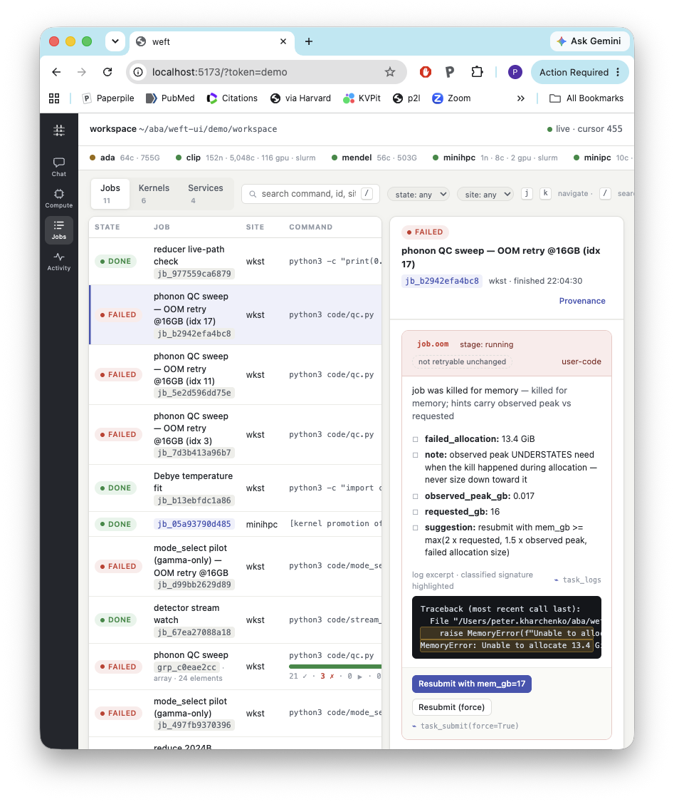

# weft-ui

Reference UI implementation for driving [weft](../weft) — the execution
substrate for agent-driven scientific analysis. Three surfaces over one
local server that embeds a single `Weft` controller per workspace:

1. **Chat** — a generic agent panel (Claude Agent SDK) whose weft-specific
   tool renderers show plans, structured errors, and event digests. *(M3)*
2. **Compute** — site setup wizard (probe-first, ~/.ssh/config-aware) and
   live capability/load/footprint status per site. *(M2)*
3. **Jobs** — monitor/controller for tasks, arrays, kernels, and services:
   live logs, structured failures with one-click remediation, provenance.
   ***(live)***

Design principle (from weft): the user and the agent are peers — every
button is an API call the agent could also make (each action shows its
`⌁ tool_name`), and both land in the same audit trail.

<p align="center">
  <a href="docs/compute.png"></a>
  <a href="docs/jobs-panel.png"></a>
</p>
<p align="center"><sub>Compute (site capabilities, live storage) and Jobs (structured OOM failure with one-click remediation) — click for full resolution.</sub></p>

## Quick start

```sh
pixi install && pixi run web-install && pixi run web-build

# serve a workspace (mints a token, prints the URL to open)
pixi run serve                      # demo/workspace
# or: pixi shell; weft-ui serve --workspace /path/to/project

# populate the demo story (DFT survey: OOM pilot, qc array with failure
# buckets, memoized resubmit, live-log stream) — drives the running
# server over its own HTTP facade:
pixi run serve &   # with --token demo (see pixi.toml) …
pixi run seed
```

Frontend dev loop: `pixi run web-dev` (vite on :5173, proxies `/api` to
:8999; open `http://localhost:5173/?token=…`).

## Architecture (short form; misc/plan.md has the full plan)

- `server/weft_ui/` — FastAPI, single process, single asyncio loop.
  - `facade.py` — `POST /api/w/<tool>` for every tool in weft's
    `PUBLIC_TOOLS`, generated by introspection; tool returns pass through
    verbatim (weft's returns-never-raises contract crosses HTTP intact:
    errors are payloads inside a 200; HTTP codes are transport only).
  - `events.py` — weft's store bus bridged to one SSE stream with cursor
    replay; stale cursors and slow clients get a `_resync` control event.
    The UI never polls.
  - `uiapi.py` — list endpoints not yet in PUBLIC_TOOLS + the live log
    sub-stream (`task_logs` cursor-poll at 1 s, labeled honestly).
  - `lock.py` — flock on `.weft/ui.lock`: one controller per workspace.
- `web/` — Vite + React + TS; design tokens in `web/src/tokens.css`,
  layout in `web/src/app.css`.
- `shared/types.ts` — hand-mirrored weft payload shapes;
  `server/tests/test_conformance.py` captures real payloads into
  `shared/samples/` and fails loudly when upstream weft reshapes them
  (`shared/samples/BASELINE` records the weft SHA; refresh with
  `UPDATE_SAMPLES=1 pixi run test`).

Security: binds 127.0.0.1 only; per-process bearer token (injected into
the served page); Origin checked on every `/api` request.

`pixi run test` · `pixi run lint`; working notes in `misc/` (untracked).
